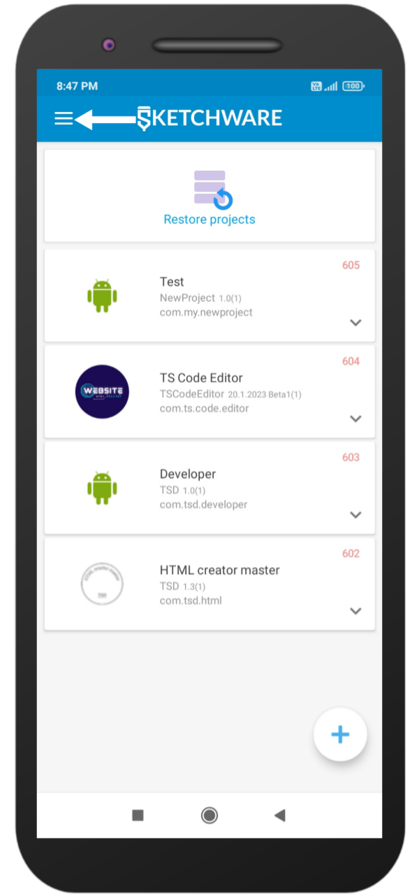
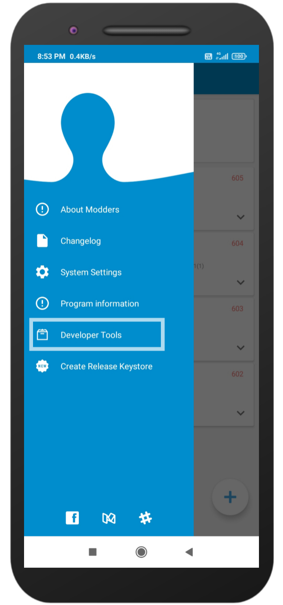
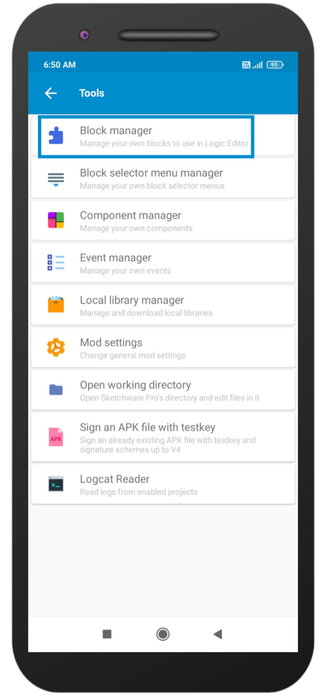
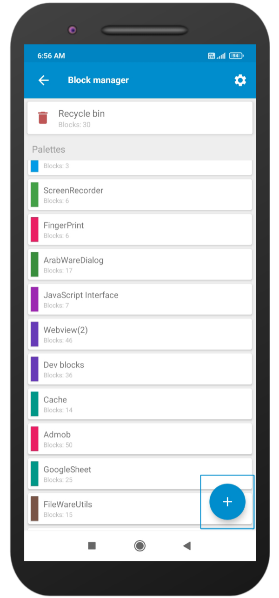
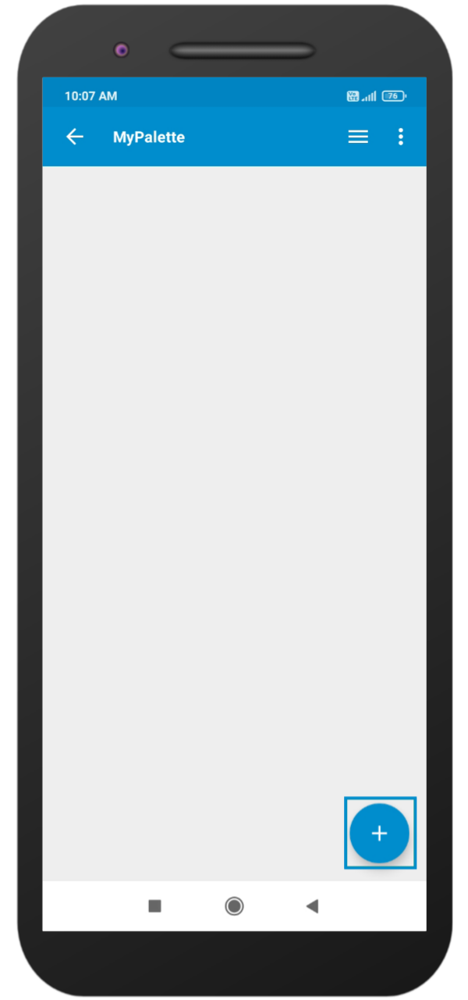
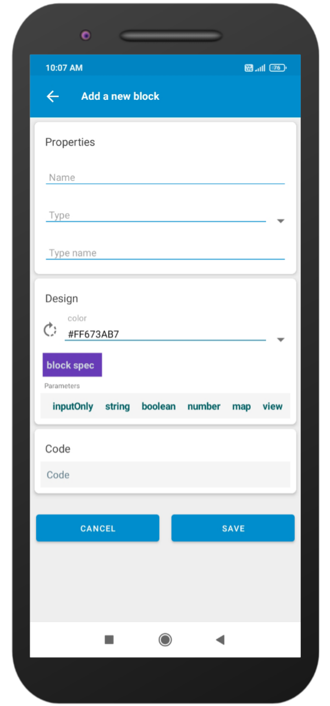
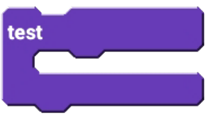

To create Block in Sketchware pro you need to know some terms of Block.

## Create a Block in Sketchware
Step 1: Go to Sketchware and click on 3 dots.

Step 2: Go to developer tools.

Step 3: Select Block manager.

Step 4: Click on Add icon.

Step 5: Enter a name for the palette name as you want and select a color by clicking on the color icon and then clicking on save.

Step 6: Here at the bottom a palette has been created successfully just click it and it will open a new screen.

Step 7: Click on add icon.

Step 8: Fill in the fields as your need and click on Save.

## Block fields
| Field | Explanation | Required |
| --- | --- | --- |
| [Name](#name) | This is a unique name of your Block. Sketchware uses this to identify different Blocks. This field should not be the same as other blocks. | Yes |
| [Type](#type) | Please enter value according to your block code(Eg. Void,If-then,If-else etc). | Yes |
| [Type Name](#type-name) | Read [Type Name](#type-name) | If [Type](#type) is `c` then this field is required. |

### Name
This is a unique name for a block. Sketchware pro uses this as the id of the block. If you use a Block in a project then Sketchware pro will use this property to identify each block and its code. This property cannot be the same for other blocks because it may cause errors.
### Type
Study the below data.
- regular

- c(if block)

- e(if-else block)

- s(String)

- b(Boolean)

- d(Number)

- v(Variable)

- a(Map)

- f(stop block)

- l(List)

- c(Component)

### Type Name
This field is not required until the [Type Name](#type-name) is `c`.
This property tells Sketchware pro that the block is related to a component that is defined in the **Type Name** property.
